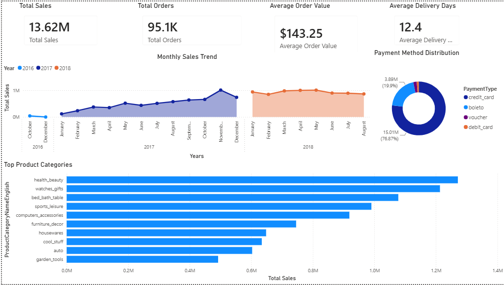
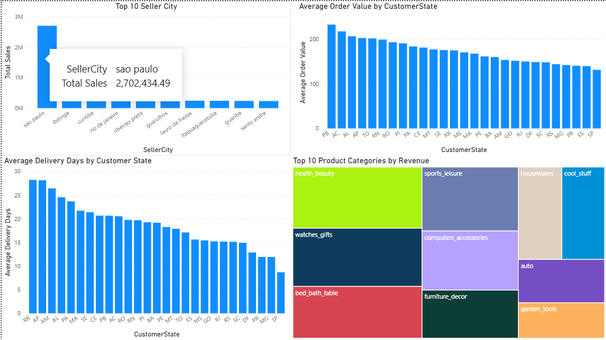
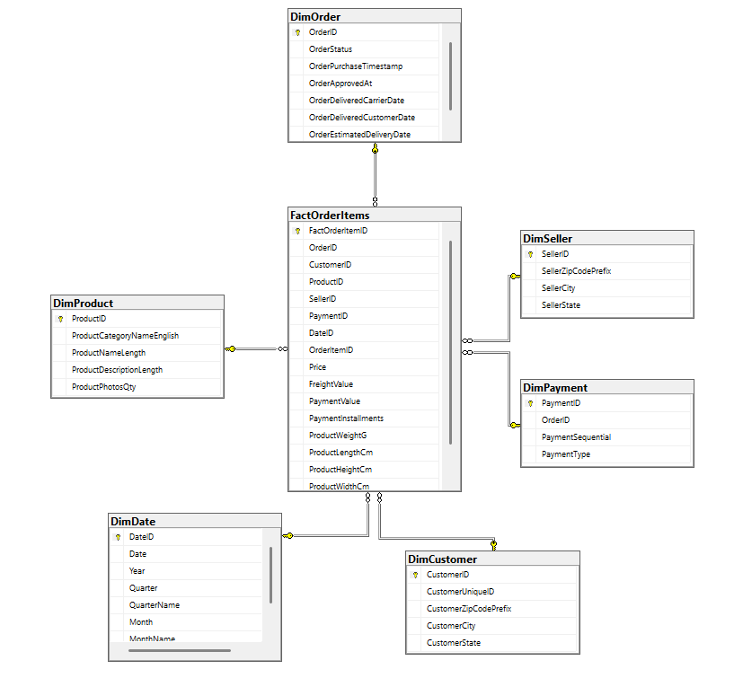
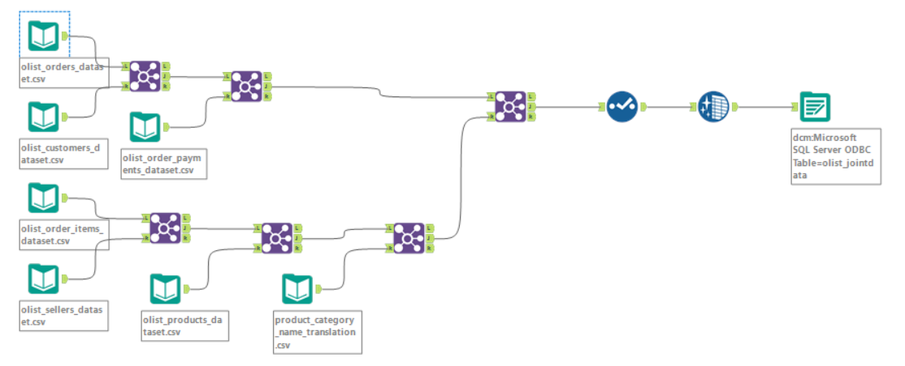
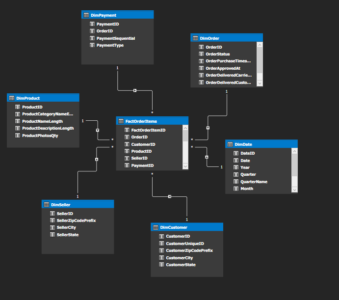

# 🇧🇷 Brazilian E-Commerce Analytics (Olist Dataset)

An end-to-end Business Intelligence project that transforms raw Brazilian e-commerce data into a dimensional data warehouse, semantic model, and interactive Power BI dashboards.

This project demonstrates practical skills in **ETL, SQL Server, Data Warehousing, SSAS Tabular, DAX, SQL Analytics, and Power BI**.

---

## Dashboard Preview

### Executive Sales Dashboard



### Customer & Seller Insights



---

# Project Architecture

```
Raw Olist CSV Files
        │
        ▼
Alteryx ETL
(Data Cleaning & Integration)
        │
        ▼
SQL Server Data Warehouse
(OlistECommerceDW)
        │
        ▼
Star Schema
(Dimensions + Fact Table)
        │
        ▼
SSAS Tabular Model
(DAX Measures)
        │
        ▼
Power BI Dashboard
```

---

# Technology Stack

| Technology | Purpose |
|------------|---------|
| Alteryx | ETL & Data Cleaning |
| SQL Server | Data Warehouse |
| SQL Server Management Studio | Database Development |
| SSAS Tabular | Semantic Model & DAX |
| Power BI | Interactive Dashboards |
| Git & GitHub | Version Control |

---

# Data Warehouse Design

The project implements a Kimball-style star schema consisting of one fact table and six dimension tables.

## Fact Table

- FactOrderItems

## Dimension Tables

- DimCustomer
- DimDate
- DimOrder
- DimPayment
- DimProduct
- DimSeller

### Star Schema



---

# ETL Process

Raw data from the Olist Brazilian E-Commerce dataset was processed using Alteryx.

Key ETL tasks included:

- Cleaning inconsistent records
- Handling missing values
- Removing duplicates
- Data type standardization
- Joining multiple datasets
- Translating Portuguese product categories into English
- Exporting the cleaned dataset to SQL Server

### ETL Workflow



---

# SSAS Tabular Model

The SQL Server Analysis Services (SSAS) Tabular model provides a semantic layer for reporting and analytics.

### Implemented Features

- Star schema relationships
- Business-friendly semantic model
- Hidden technical key columns
- DAX measures for reporting

### DAX Measures

- Total Sales
- Total Orders
- Average Order Value
- Total Freight
- Total Payment Value
- Average Delivery Days

### SSAS Model



---

# SQL Business Analysis

Business analysis was performed using SQL Server with queries covering:

- Monthly sales trends
- Top product categories
- Top sellers
- Customer distribution
- Payment method analysis
- Delivery performance
- Freight cost analysis

SQL scripts:

```
sql/analysis_queries.sql
```

---

# Power BI Dashboard

The Power BI report contains two interactive dashboard pages.

## Executive Sales Dashboard

- Total Sales KPI
- Total Orders KPI
- Average Order Value
- Average Delivery Days
- Monthly Sales Trend
- Top Product Categories
- Payment Method Distribution

## Customer & Seller Insights

- Top Sellers by Revenue
- Top States by Average Order Value
- Average Delivery Days by State
- Revenue by Product Category

Power BI file:

```
powerbi/Brazilian_Ecommerce.pbix
```

---

# Repository Structure

```
Brazilian-E-Commerce-Analytics
│
├── data/
├── images/
├── powerbi/
├── sql/
├── ssas/
└── README.md
```

---

# Skills Demonstrated

- ETL Development
- Data Cleaning & Validation
- SQL Server
- Data Warehousing
- Star Schema Design
- SSAS Tabular Modeling
- DAX Measures
- SQL Analytics
- Power BI Dashboard Design
- Business Intelligence

---

# Dataset

Brazilian E-Commerce Public Dataset by Olist (Kaggle)

---

# Author

**Cheung Pang Li**

Postgraduate Certificate in Big Data Analytics

British Columbia Institute of Technology (BCIT)
