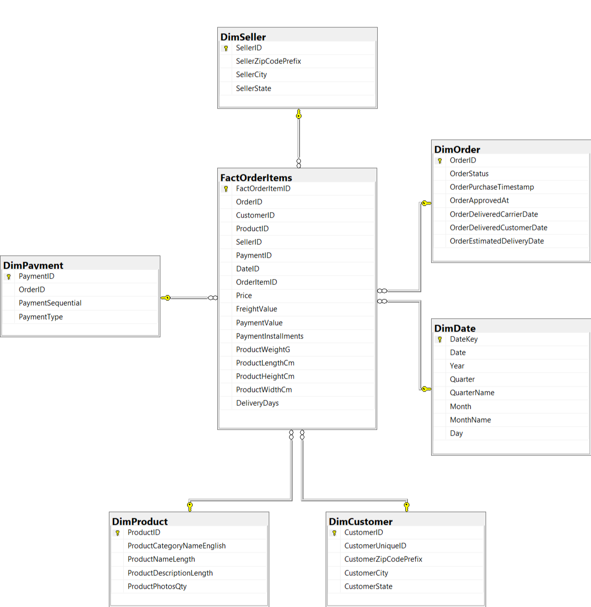

# Brazilian E-Commerce Analytics (Olist Dataset)

An end-to-end Business Intelligence and Data Analytics project using the Brazilian Olist E-Commerce dataset. This project demonstrates the complete analytics pipeline, including ETL, dimensional data modeling, SQL analysis, SSAS Tabular modeling, and Power BI dashboard development.

---

## Project Overview

This project transforms raw Brazilian e-commerce data into a business intelligence solution using a modern analytics workflow.

The project covers:

- Data cleaning and preprocessing using Alteryx
- SQL Server data warehouse implementation
- Star schema dimensional modeling
- SSAS Tabular model development
- SQL business analysis
- Interactive Power BI dashboards

---

## Tech Stack

| Tool | Purpose |
|------|---------|
| Alteryx | ETL & Data Cleaning |
| SQL Server (SSMS) | Data Warehouse |
| SSAS Tabular | Semantic Data Model |
| SQL | Business Analysis |
| Power BI | Dashboard & Visualization |

---

## Dataset

**Source**

Brazilian E-Commerce Public Dataset by Olist

https://www.kaggle.com/datasets/olistbr/brazilian-ecommerce

The dataset contains information on:

- Customers
- Sellers
- Products
- Orders
- Payments
- Reviews
- Delivery information
- Product category translations

---

# Project Workflow

```
Raw CSV Files
        │
        ▼
Alteryx ETL
        │
        ▼
SQL Server Staging Table
        │
        ▼
Star Schema
        │
        ▼
SSAS Tabular Model
        │
        ▼
SQL Analysis
        │
        ▼
Power BI Dashboard
```

---

# Repository Structure

```
Brazilian-E-Commerce-Analytics
│
├── README.md
├── data
├── sql
├── powerbi
├── images
└── docs
```

---

# ETL Process

The raw Olist datasets were imported into Alteryx where the following transformations were performed:

- Removed duplicate records
- Removed invalid records
- Handled missing values
- Standardized data types
- Converted date fields
- Translated Portuguese product categories into English
- Created calculated fields
- Joined multiple datasets into a unified staging table
- Exported the cleaned data into SQL Server

---

# Data Warehouse

Database

```
OlistECommerce
```

The final warehouse follows a star schema consisting of one fact table and six dimension tables.

### Fact Table

- FactOrderItems

### Dimension Tables

- DimCustomer
- DimDate
- DimOrder
- DimPayment
- DimProduct
- DimSeller

---

# Entity Relationship Diagram





---

# SQL Schema

The SQL schema used to create the data warehouse is available in:

```
sql/schema.sql
```

---

# SQL Business Analysis

Business analysis queries include:

- Monthly sales trend
- Top-selling product categories
- Top customers by revenue
- Payment method analysis
- Delivery performance

Source:

```
sql/analysis_queries.sql
```

*(Coming in Role 4)*

---

# Power BI Dashboard

Interactive dashboards will provide insights into:

- Sales Performance
- Customer Analysis
- Product Performance
- Seller Analysis
- Delivery Performance

*(Coming in Role 5)*

---

# Project Highlights

✔ ETL using Alteryx

✔ Star Schema Data Warehouse

✔ SQL Server Implementation

✔ SSAS Tabular Model

✔ SQL Business Analysis

✔ Interactive Power BI Dashboard

---

# Future Improvements

- Incremental ETL pipelines
- Data quality validation automation
- Power BI deployment to Power BI Service
- Advanced DAX measures
- Predictive analytics using Python

---

# Author

**Cheung Pang Li**

LinkedIn:
*(your LinkedIn URL)*

GitHub:
*(your GitHub profile)*
